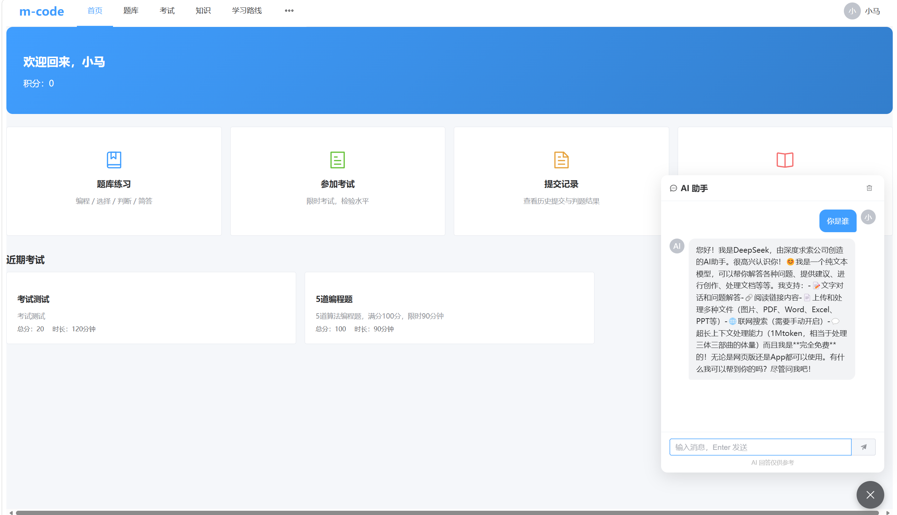
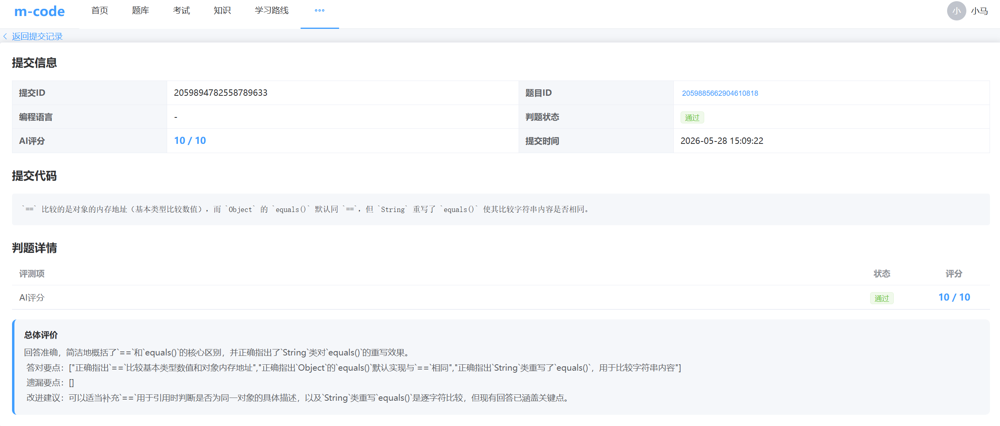
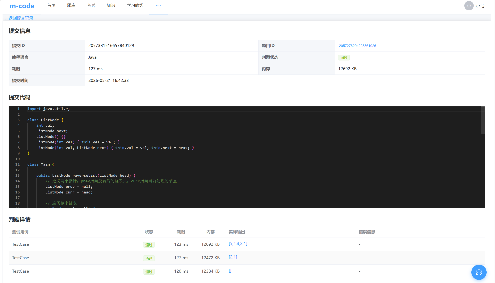
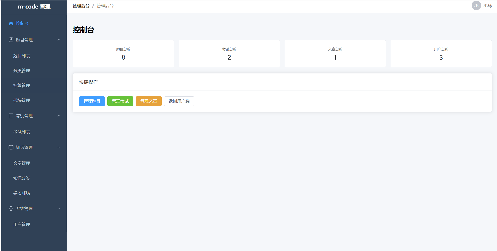

# m-code

在线编程刷题平台，支持编程题判题、考试管理、知识库与 AI 辅助学习。









## 系统架构

```
Client (Browser)
  │
  ▼
API Gateway (8080) ── JWT 认证、路由转发、CORS
  │
  ├── m-code-user      (8081) ── 用户服务（注册/登录/个人信息）
  ├── m-code-question  (8082) ── 题库服务（题目/分类/标签/板块 CRUD）
  ├── m-code-judge     (8083) ── 判题服务（代码提交、编译运行、判题）
  ├── m-code-exam      (8084) ── 考试服务（考试管理、作答、成绩排名）
  ├── m-code-knowledge (8085) ── 知识库（文章、分类、学习路线）
  └── m-code-ai        (8086) ── AI 助手（流式对话、代码提示、评分）
         │                │
         └── Nacos ──────┘  服务注册 & 配置中心 (:8848)

MySQL (:3306)    Redis (:6379)    RabbitMQ (:5672)    Elasticsearch (:9200)
```

## 核心功能

- **在线刷题** — 多种题型（编程题、选择题、判断题、简答题），支持 Java / Python / C++ / C / JavaScript / Go 多语言在线提交
- **自动判题** — 编程题异步判题（RabbitMQ），简答题 AI 自动评分（接入 DeepSeek）
- **考试系统** — 限时考试、自动组卷、交卷自动判分、成绩排名
- **AI 助手** — 页面悬浮对话框，支持流式对话（SSE）、代码解释、题目提示
- **知识库** — 技术文章、分类管理、学习路线，Elasticsearch 全文搜索
- **管理后台** — 题目管理、考试管理、分类/标签/板块管理

## 技术栈

### 后端

| 技术                   | 版本         | 说明                                 |
| -------------------- | ---------- | ---------------------------------- |
| JDK                  | 17         |                                    |
| Spring Boot          | 3.2.5      |                                    |
| Spring Cloud         | 2023.0.3   | Gateway + OpenFeign + LoadBalancer |
| Spring Cloud Alibaba | 2023.0.1.0 | Nacos 服务注册 & 配置中心                  |
| Spring AI            | 1.1.2      | AI 对话/评分 (OpenAI 兼容接口)             |
| MyBatis-Plus         | 3.5.7      | ORM，Lambda 查询，分页，逻辑删除，自动填充         |
| MySQL                | 8.0        | Druid 连接池                          |
| Redis                | —          | 缓存                                 |
| RabbitMQ             | —          | 异步判题消息队列                           |
| Elasticsearch        | —          | 知识库全文搜索                            |
| JWT (jjwt)           | 0.12.6     | 无状态认证                              |
| Hutool               | 5.8.29     | 工具库 / BCrypt 密码加密                  |

### 前端

| 技术            | 版本   |
| ------------- | ---- |
| Vue           | 3.5  |
| TypeScript    | 6.0  |
| Vite          | 8.0  |
| Element Plus  | 2.14 |
| Pinia         | 3.0  |
| Monaco Editor | 0.55 |

## 模块说明

```
m-code/
├── m-code-parent/      父 POM，统一依赖版本管理
├── m-code-common/      公共模块（BaseEntity、Result、枚举、全局异常处理、MyBatis-Plus 配置）
├── m-code-gateway/     API 网关（JWT 认证、路由转发、CORS）
├── m-code-user/        用户服务（注册、登录、个人信息）
├── m-code-question/    题库服务（题目、分类、标签、板块 CRUD）
├── m-code-judge/       判题服务（代码提交、编译执行、判题结果、异步消费）
├── m-code-exam/        考试服务（考试管理、作答、交卷、判分、排名）
├── m-code-knowledge/   知识库服务（文章、分类、学习路线、全文搜索）
├── m-code-ai/          AI 服务（流式对话、代码解释、题目提示、简答题评分）
├── front/              Vue 3 前端（用户端 + 管理后台）
└── CLAUDE.md           项目开发指南（AI 辅助开发配置文件）
```

## 快速开始

### 环境要求

- JDK 17+
- Maven 3.8+
- Node.js 20+
- MySQL 8.0
- Redis（默认 `localhost:6379`）
- RabbitMQ（默认 `localhost:5672`，管理账户 `admin/admin`）
- Elasticsearch（可选，知识库服务需要，默认 `localhost:9200`）
- Nacos（默认 `localhost:8848`）

### 本地开发

**1. 准备数据库**

创建 MySQL 数据库 `mcode`，启动 MySQL、Redis、RabbitMQ、Nacos。

**2. 构建后端**

```bash
# 构建全部模块
mvn clean install -DskipTests

# 按顺序启动各服务
mvn spring-boot:run -pl m-code-user &
mvn spring-boot:run -pl m-code-question &
mvn spring-boot:run -pl m-code-judge &
mvn spring-boot:run -pl m-code-exam &
mvn spring-boot:run -pl m-code-knowledge &
mvn spring-boot:run -pl m-code-ai &
mvn spring-boot:run -pl m-code-gateway &
```

**3. 启动前端**

```bash
cd front
npm install
npm run dev
```

前端开发服务器运行在 `http://localhost:5173`，API 请求自动代理到 Gateway `http://localhost:8080`。

**4. 配置 AI 服务（可选）**

设置环境变量以启用 AI 功能（默认使用 DeepSeek）：

```bash
export AI_API_KEY=your-api-key
export AI_BASE_URL=https://api.deepseek.com
export AI_MODEL=deepseek-chat
```

### 服务端口一览

| 服务           | 端口   |
| ------------ | ---- |
| API Gateway  | 8080 |
| user         | 8081 |
| question     | 8082 |
| judge        | 8083 |
| exam         | 8084 |
| knowledge    | 8085 |
| ai           | 8086 |
| Frontend Dev | 5173 |

## API 概览

所有 API 请求通过 Gateway (`http://localhost:8080`) 统一入口，JWT Bearer Token 认证（白名单：登录、注册接口）。

| 模块  | 前缀                  | 说明            |
| --- | ------------------- | ------------- |
| 用户  | `/api/user/**`      | 注册、登录、个人信息    |
| 题库  | `/api/question/**`  | 题目、分类、标签、板块   |
| 判题  | `/api/judge/**`     | 代码提交、判题结果     |
| 考试  | `/api/exam/**`      | 考试管理、作答、成绩    |
| 知识库 | `/api/knowledge/**` | 文章、分类、学习路线    |
| AI  | `/api/ai/**`        | 对话、提示、代码解释、评分 |

统一响应格式：`{ "code": 200, "message": "操作成功", "data": {} }`

## 许可证

[Apache License 2.0](LICENSE)
